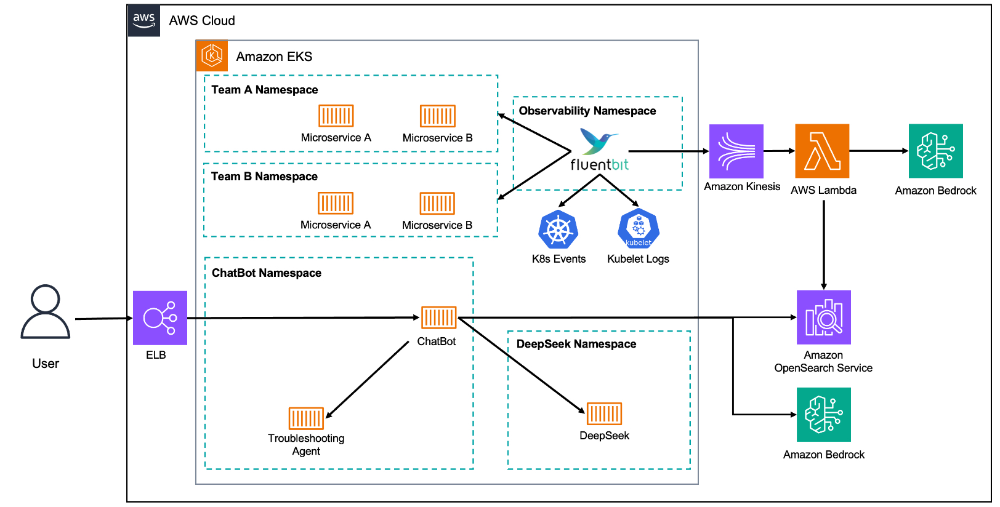

## EKS Troubleshooting Assistant

An intelligent troubleshooting chatbot powered by Large Language Models (LLMs) to help support engineers diagnose and resolve issues with applications running on Amazon EKS.

The ingestion pipeline collects and processes application logs, Kubernetes events, and kubelet logs. These are then embedded using Amazon Bedrock and stored in OpenSearch for efficient retrieval.

Leveraging Retrieval-Augmented Generation (RAG), the agentic chatbot enhances LLM responses by incorporating relevant cluster data. It stands out by actively investigating issues—generating and executing **read-only kubectl commands** when necessary—offering detailed troubleshooting insights based on real-time cluster information and historical data.




## Prerequisites

Before running this project, make sure you have the following installed:

- [Terraform](https://www.terraform.io/downloads.html)
- [Docker](https://docs.docker.com/engine/install/) or [Finch](https://runfinch.com/docs/getting-started/installation/)

## Setup and Execution


### Step 1: Provision AWS Resources

First, you need to provision the necessary AWS resources.

1. Clone the repository:

    ```bash
    git clone https://github.com/aws-samples/sample-eks-troubleshooting-rag-chatbot && cd eks-llm-troubleshooting/terraform/
    ```
2. [**Optional: Required for Slack integration**] Create `terraform.tfvars` file in the `terraform` directory for Slack webhook and channel name:
    
    Example contents of `terraform.tfvars`
    ```bash
    slack_webhook_url = "https://hooks.slack.com/services/[YOUR-WEBHOOK]"
    slack_channel_name = "alert-manager-alerts"
    ```

3. Run install script to initialize and install terraform modules.

    ```bash
    cd sample-eks-troubleshooting-rag-chatbot/terraform/

    ./install.sh
    ```

#### Configuration

- **Local Variables**: The `locals` section in the Terraform script defines the region, VPC CIDR, and availability zones.
- **Tags**: The provisioned resources are tagged with the blueprint name and the GitHub repository URL.

### Step 2: Deploy Problem Pods for Testing

You can deploy problem pods into your EKS cluster to generate logs for testing. Use the provided bash script to deploy these pods:

```bash
./provision-delete-error-pods.sh -p db-migration
```

This script will create various pods that are likely to generate errors and logs, which the chatbot can then use for troubleshooting.

### Step 3: Use the Chatbot

The Chatbot is running as a deployment in the Kubernetes cluster, you can use it to troubleshoot logs from the problematic pods you deployed earlier.
The chatbot will fetch relevant logs based on the user's query and provide context-aware responses.

```bash
# Forward the Chatbot service port to your local machine
kubectl port-forward -n agentic-chatbot service/agentic-chatbot 7860:7860
```

Now you can access it with your preferred browser using the following URL: `http://localhost:7860`

### Cleanup
```bash
# Destroy the Terraform resources
terraform destroy --auto-approve
```

## Acknowledgments

This project uses:

- [Gradio](https://www.gradio.app/) for the user interface.
- [Terraform AWS EKS Blueprints](https://github.com/aws-ia/terraform-aws-eks-blueprints) as the basis for provisioning the infrastructure.

## Security

See [CONTRIBUTING](CONTRIBUTING.md#security-issue-notifications) for more information.

## License

This library is licensed under the MIT-0 License. See the LICENSE file.

